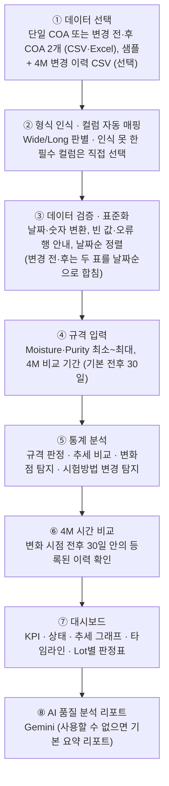
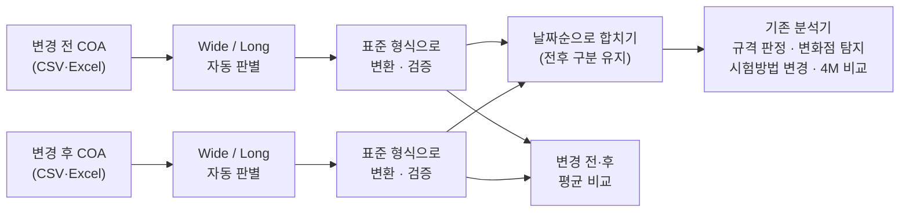

# LotWatch AI

### 규격 이내의 품질 변화까지 찾아내는 AI 품질 모니터링

> "규격을 통과했더라도, 품질 데이터가 평소와 달라지고 있다면 알려드립니다."

---

## 1. 프로젝트 소개

**LotWatch AI**는 공급사 COA·수입검사 데이터를 시간순으로 분석해, 규격을 통과한 Lot 안에서도 평소와 달라진 품질 변화를 찾아내고 품질 담당자가 확인할 항목을 알려주는 **Supplier Quality Change Monitoring** 도구입니다.

원티드 AI Championship 2026 출품 프로젝트입니다.

---

## 2. Demo 링크

| | 링크 |
|---|---|
| 🔗 **Demo** | https://quality-change-ai.streamlit.app |
| 💻 **GitHub** | https://github.com/iamnothuman440/lotwatch-ai |

**Demo 체험 순서:** `샘플 데이터로 분석하기` → 결과 대시보드 확인 → `AI 분석 리포트 생성`

**변경 전·후 비교 체험:** `분석 방식`에서 `변경 전·후 COA 비교` 선택 → 파일 없이 `분석 시작` (변경 전 Wide · 변경 후 Long 예시 데이터) → 결과 확인

> Demo는 Streamlit Community Cloud(무료)에서 동작합니다. 한동안 접속이 없으면 앱이 잠들 수 있으며, 이때는 첫 화면의 깨우기 버튼을 누르고 잠시 기다리면 됩니다.

---

## 3. 문제 정의

### 단순 규격 Pass/Fail 판정의 한계

수입검사와 COA 검토는 보통 **Lot별로 규격 안에 있는지(Pass/Fail)** 를 확인합니다. 이 방식에서는 다음과 같은 변화가 잘 드러나지 않습니다.

- 모든 Lot이 규격을 통과하는 동안 **평균이 한 단계 올라가거나 조금씩 움직이는 변화**
- Lot을 하나씩 볼 때는 보이지 않는 **시간에 따른 추세**
- 측정값의 비교 기준 자체를 바꿀 수 있는 **시험방법 변경**
- 공급사의 4M(Man·Machine·Material·Method) 변경 기록과 **데이터 변화 시점의 관계**

### 규격 이내 품질 변화를 일찍 발견해야 하는 이유

이런 변화는 규격 이탈이나 고객 불만으로 이어진 뒤에야 확인되기 쉽습니다. 규격 이내에서 변화가 시작된 시점에 알 수 있다면, 규격 이탈 전에 공급사에 변경 여부와 원인을 확인할 시간을 확보할 수 있습니다.

---

## 4. LotWatch AI의 해결 방법

1. **"규격 부적합"과 "변화 감지"를 분리해서 보여줍니다.** 규격을 모두 통과해도 평균이 달라졌다면 따로 알려줍니다.
2. Lot 데이터를 날짜순으로 정렬한 뒤 **품질 특성별로 평균이 달라진 시점(변화점)을 통계적으로 탐지**합니다.
3. **시험방법이 바뀐 Lot**을 찾아 표시합니다.
4. 감지된 변화 시점과 **등록된 4M 변경 이력의 날짜 관계**를 비교합니다. (기본: 변화 시점 전후 30일)
5. 통계 결과를 바탕으로 **Gemini가 확인사항 리포트를 정리**합니다. AI를 쓸 수 없을 때는 통계 결과로 만든 기본 요약 리포트를 보여줍니다.
6. 공정·원료 등의 **변경 전·후 COA 2개**를 받아, 두 파일의 형식이 달라도 각각 표준 형식으로 바꾼 뒤 합쳐서 같은 방식으로 분석하고 전후 평균을 함께 보여줍니다.

LotWatch AI는 부적합이나 원인을 자동으로 확정하지 않습니다. **통계적으로 변화가 감지되면 품질 담당자가 확인할 수 있도록 알려주는 확인 권고 도구**이며, 최종 판단은 품질 담당자가 합니다.

---

## 5. 전체 분석 Workflow



1. **데이터 선택** — `분석 방식`에서 **단일 COA 분석** 또는 **변경 전·후 COA 비교**를 고릅니다. 단일 분석은 `샘플 데이터로 분석하기`를 누르거나 COA 파일(CSV 또는 Excel) 1개를, 변경 전·후 비교는 COA 파일 2개(변경 전·변경 후)를 올립니다. 4M 변경 이력 CSV(선택)는 두 방식 모두 하나만 올립니다.
2. **형식 인식 · 컬럼 자동 매핑** — 업로드하면 바로 분석하지 않고 형식(Wide/Long)과 "COA 컬럼을 다음과 같이 인식했습니다." 표를 먼저 보여줍니다. 확인 후 `이대로 분석하기`(변경 전·후 비교는 `변경 전·후 분석하기`)를 누릅니다.
3. **데이터 검증** — 날짜와 수치를 변환하고, 문제가 있으면 몇 번째 행인지 알려줍니다. 여러 공급사가 섞여 있으면 분석할 공급사를 고릅니다. 변경 전·후 비교는 파일마다 따로 검증·표준화한 뒤 두 표를 날짜순으로 합칩니다.
4. **규격 입력** — Moisture·Purity의 최소값·최대값과 4M 비교 기간을 입력합니다.
5. **통계 분석 → 4M 비교 → 대시보드** — 분석 결과를 KPI, 상태, 그래프, 표로 보여줍니다.
6. **AI 품질 분석 리포트** — `AI 분석 리포트 생성` 버튼을 누르면 리포트를 만듭니다.

---

## 6. 핵심 기능

### 6.1 CSV / Excel COA 입력

- COA 파일은 **CSV** 또는 **Excel(.xlsx)** 로 올릴 수 있습니다. Excel은 **첫 번째 시트**를 읽습니다.
- **Wide Format**(1행 = 1 Lot)과 **Long Format**(1행 = Lot 1개의 시험항목 1개)을 모두 읽습니다. 컬럼을 보고 형식을 자동으로 고르며, Long Format은 Parameter·MeasuredValue 컬럼으로 표준 형식을 만든 뒤 분석합니다. ([13장](#13-입력-데이터-형식) 참고)
- CSV는 UTF-8과 엑셀에서 저장한 한글 CSV(CP949)를 모두 읽습니다.
- 4M 변경 이력은 **CSV**로 올립니다. (선택 사항)
- 분석 방식은 **단일 COA 분석**과 **변경 전·후 COA 비교** 두 가지입니다. 변경 전·후 비교는 [6.8](#68-변경-전후-coa-비교)을 참고하세요.

### 6.2 COA 컬럼 자동 매핑

공급사마다 다른 컬럼명을 LotWatch 표준 컬럼으로 연결한 뒤 분석기에 전달합니다. **필수 컬럼은 Lot, Date, Supplier, Moisture, Purity 5개**이고, **Test_Method는 선택 컬럼**입니다. (Long Format은 Moisture·Purity 컬럼 대신 Parameter·MeasuredValue 컬럼에서 두 값을 만듭니다.)

| 표준 컬럼 | 자동으로 인식하는 컬럼명 |
|---|---|
| Lot | Lot, Lot No., Lot Number, LotNo, Batch, Batch No., Batch Number, BatchNo |
| Date | Date, Test Date, Inspection Date, InspectDate, 검사일, 시험일, 분석일 |
| Supplier | Supplier, Supplier Name, Vendor, VendorName, 공급업체, 공급사, 공급자, 납품업체 |
| Moisture | Moisture, Moisture (%), Moisture Content, Moisture Content (%), Water Content, Water Content (%), 수분, 수분(%), 수분 함량, 수분함량 |
| Purity | Purity, Purity (%), Assay, 순도, 순도(%) |
| Test_Method (선택) | Test_Method, Test Method, Method, 시험방법, 분석방법, Analytical Method, Test Procedure, Analysis Method, Analytical Procedure, 시험 방법, 분석 방법, 시험법, 분석법 |
| Parameter (Long Format) | Parameter, Test Item, 시험항목, 검사항목 |
| MeasuredValue (Long Format) | MeasuredValue, Measured Value, Result Value, Test Result, 측정값, 측정 결과, 시험결과 |
| LSL · USL (Long Format, 선택) | LSL, Lower Spec Limit, 규격 하한, 하한 · USL, Upper Spec Limit, 규격 상한, 상한 |

- 대소문자, 공백, 괄호, `_`, `-`, `.`, `%` 차이는 무시하고 비교합니다. (예: `BATCH_NO` → Lot)
- Moisture·Purity 이름 목록은 Long Format의 Parameter 값(시험항목 이름)을 판별할 때도 사용합니다.
- 인식 결과는 "원본 컬럼 → LotWatch 컬럼" 표로 먼저 보여줍니다.
- 필수 컬럼을 찾지 못하면 "다음 필수 컬럼을 인식하지 못했습니다: Moisture, Purity"처럼 정확히 알려주고, 원본 컬럼을 **직접 선택**할 수 있는 칸을 보여줍니다. 모두 연결되기 전에는 `이대로 분석하기` 버튼이 비활성화됩니다.
- 선택 컬럼인 Test_Method를 자동으로 찾지 못하면 `Test_Method(시험방법) 컬럼` 선택칸에서 원본 컬럼을 직접 고를 수 있습니다. 기본값 `없음`으로 두면 오류 없이 시험방법 변경 분석만 건너뜁니다. (Wide·Long, 변경 전·후 파일 모두 같음)

### 6.3 규격 부적합 판정

- 사용자가 입력한 규격(최소값 ≤ 측정값 ≤ 최대값, 경계값 포함) 안에 있으면 **PASS**, 벗어나면 **OUT OF SPEC**입니다.
- 기본 규격은 Moisture 0.00 ~ 0.50, Purity 99.00 ~ 100.00이며 화면에서 바꿀 수 있습니다.
- 규격 부적합 Lot은 KPI, 그래프(빨간 점), Lot별 판정표에 표시되고, 판정표는 CSV로 내려받을 수 있습니다.

### 6.4 통계 기반 품질 변화 탐지

Moisture와 Purity 각각에 대해, **평균이 달라진 지점(변화점) 1개**를 찾습니다.

- **찾는 방법:** 데이터를 "앞 구간"과 "뒤 구간"으로 나누는 모든 위치를 시험해, 두 구간을 각자의 평균으로 설명했을 때 남는 오차(제곱합)가 가장 작은 위치를 변화점 후보로 고릅니다.
- **변화 감지 기준:** 아래 두 조건을 **모두** 만족할 때만 "변화 감지"로 판단합니다.
  - 변화 전후 평균 차이가 평소 변동폭(두 구간의 합동 표준편차)의 **1.5배 이상**
  - Welch t-검정 **p-value < 0.01**
- 변화 전/후 구간에는 각각 최소 **4 Lot**이 필요합니다. 전체가 8 Lot 미만이면 변화점 분석을 건너뛰고, 10 Lot 미만이면 데이터가 부족하다는 안내를 표시합니다.
- **추세 비교:** 초기 10 Lot 평균과 최근 10 Lot 평균, 전체 평균을 함께 보여줍니다. (20 Lot 미만이면 절반씩 비교)
- 결과 화면에는 변화 시점(Lot·날짜), 변화 전/후 평균, 변화량(%), 평소 변동폭 대비 배수, p-value가 표시되고, 그래프에 변화 시점 세로선과 구간 평균선이 그려집니다.

### 6.5 시험방법 변경 탐지

- Test_Method 값을 날짜순으로 비교해, 값이 바뀐 첫 Lot을 찾습니다. (빈 값은 건너뜀)
- 예: "시험방법 변경 감지: A → B, Lot 035부터"
- 시험방법 변경은 품질 특성의 통계적 변화와 성격이 달라서 **KPI를 따로 셉니다**.
- **Test_Method는 선택 컬럼입니다.** 컬럼이 없거나 값이 모두 비어 있어도 품질 분석은 정상적으로 수행되며, 시험방법 변경 분석만 건너뛰고 KPI에 **"미분석"**으로 표시합니다. ([13장](#13-입력-데이터-형식) 참고)

### 6.6 4M 변경 이력과 시간 비교

4M은 **Man(작업자) · Machine(설비) · Material(원료) · Method(방법)** 의 변경을 뜻합니다. 4M 변경 이력 CSV의 `Type`에 구분을 적습니다. (예: Equipment, Material · 값은 자유롭게 입력) 품질 변화 시점과 등록된 4M 변경 이력의 **시간적 근접성**을 확인합니다.

- **기준 시점:** 품질 변화는 변화 후 첫 Lot의 날짜, 시험방법 변경은 새 시험방법이 처음 적용된 Lot의 날짜입니다.
- **비교 범위:** 기준 시점 **전후 30일**(기본값, 화면에서 7~90일로 조정 가능)입니다. 기준 시점 이전과 이후를 모두 포함하며, 4M 기록 날짜와 기준 시점의 차이가 설정한 일수 이내이면 "근접한 4M 변경 이력"으로 표시합니다. "근접"은 날짜가 가깝다는 뜻일 뿐, 원인이라는 뜻이 아닙니다.
- **범위 안에 기록이 있으면:** "변화 시점과 근접한 4M 변경 이력이 있습니다. 변경 내용과 품질 영향을 확인해 주세요."
- **범위 안에 기록이 없으면:** "…해당 기간 내 등록된 4M 변경 이력이 확인되지 않았습니다. 공급사에 변경 여부 및 원인 확인을 권고합니다." 그리고 가장 가까운 기록을 보여줄 때는 반드시 **"(변화 시점 N일 전/후, 비교 범위 밖)"** 으로 표시합니다.
- **4M 기록이 아예 없으면** 가장 가까운 기록은 표시하지 않습니다. 4M 파일을 올리지 않으면 "4M 변경 이력 데이터가 없어 비교하지 못했습니다"라고 안내합니다.
- 변화와 4M 이력을 날짜순으로 나열한 **타임라인 표**를 함께 보여줍니다.
- 4M 비교는 **날짜가 가까운지만** 확인합니다. 4M 기록이 시간적으로 가깝다는 것은 원인이라는 뜻이 아니며, 4M 변경이 있다고 해서 그것을 품질 변화의 원인으로 자동 판단하지 않습니다. 비교 범위 밖의 기록을 원인으로 단정하지 않습니다. 또한 "등록된 이력이 없다"는 것은 실제로 변경이 없었다는 뜻이 아닙니다.
- **시간관계 판정은 Python이 하고, AI는 설명만 합니다.** 분석기(Python)가 기록마다 비교 범위 안(`within_range`) / 밖(`out_of_range`)을, 변화마다 범위 안 등록 이력 없음(`no_record`)을 먼저 판정합니다. Gemini에는 이 판정 결과를 함께 전달해, AI가 날짜를 다시 계산하거나 관련성을 스스로 추론하지 않도록 합니다.

  ```text
  Python (분석기) → 4M 시간관계 판정 (비교 범위 안 / 밖 / 범위 안 등록 이력 없음) → Gemini → 판정 결과를 설명
  ```

### 6.7 Gemini 기반 AI 품질 분석 리포트

- `AI 분석 리포트 생성` 버튼을 누르면 통계 분석 결과를 Google Gemini에 보내 QC 담당자용 리포트를 만듭니다.
- Gemini에는 Lot별 원본 측정값 전체가 아니라 **통계 요약**(Lot 수, 평균, 변화점, 시험방법 변경, 4M 비교 결과 등)을 전달합니다. 4M은 원본 날짜 목록 대신 변화별로 Python이 판정한 시간관계(비교 범위, 기록별 범위 안/밖, 변화 시점과의 일수)를 전달하고, 변경 전·후 비교에서는 전후 Lot 수·기간·시험방법과 품질항목별 전후 평균·변화량·변화율을 함께 전달합니다.
- 모델은 `gemini-3.5-flash-lite`를 먼저 사용하고, 한도 초과나 일시 장애가 나면 `gemini-3.6-flash`로 다시 시도합니다.
- 같은 분석 결과로 다시 요청하면 저장해 둔 리포트를 재사용해 무료 사용량을 아낍니다. (앱을 다시 시작하면 초기화)
- API Key가 없거나, 호출에 실패하거나, 무료 사용 한도를 넘으면 **"AI 연결 실패로 기본 요약 리포트를 표시합니다."** 라는 안내와 함께 통계 결과로 만든 기본 요약 리포트를 보여줍니다. 이 경우에도 앱과 통계 분석은 그대로 동작합니다.
- **Gemini는 분석 결과를 대신 결정하지 않습니다.** 통계 분석이 계산한 결과를 바탕으로 확인이 필요한 이유와 확인사항을 읽기 쉽게 정리하는 역할입니다.

### 6.8 변경 전·후 COA 비교

`분석 방식`에서 **변경 전·후 COA 비교**를 고르면, 공정·원료 등의 변경 전후 COA를 `변경 전 COA`와 `변경 후 COA` 칸에 각각 올려 비교합니다. (기본값은 기존과 같은 **단일 COA 분석**)

- **전후 구분은 사용자가 지정합니다.** 날짜를 보고 전후를 추측하지 않고, 파일을 올린 칸(변경 전 / 변경 후)을 그대로 따릅니다.
- **두 파일의 형식과 컬럼명이 달라도 됩니다.** (예: 변경 전 = Wide Format, 변경 후 = Long Format) 파일마다 형식 판별 → 컬럼 매핑 → 검증 → 표준 형식 변환을 따로 한 뒤 합칩니다. 대표적인 Wide / Long 형식과 [6.2](#62-coa-컬럼-자동-매핑)의 컬럼명 변형을 정규화해 처리하며, 목록에 없는 구조의 COA까지 자동으로 처리하지는 않습니다.



**분석 방식**

- 두 표준 표를 합쳐 날짜순으로 정렬한 뒤(같은 날짜는 변경 전 먼저) **기존 분석기를 그대로 사용**합니다. 품질 변화 탐지 · 시험방법 변경 탐지 · 4M 비교의 기준과 최소 데이터 조건(변화점 분석 8 Lot 이상, 권장 10 Lot 이상)은 단일 COA 분석과 같습니다.
- 4M 변경 이력 CSV는 두 파일에 공통으로 하나를 씁니다. 파일 안에 공급사가 여러 곳이면 파일마다 분석할 공급사를 고르며, 변경 전·후 파일의 공급사가 서로 달라도 합쳐서 분석합니다.

**업로드 화면**

- 파일마다 입력 형식(자동 선택, 직접 변경 가능), 컬럼 인식 표, Long Format 변환 미리보기와 함께 `변환 상태: 정상 · 입력 형식 · Lot 수 · 기간`을 한 줄로 보여줍니다.
- 두 파일이 모두 준비되면 통합 Lot 수·기간과 확인할 점을 보여주고 `변경 전·후 분석하기` 버튼이 활성화됩니다.
- 파일을 올리지 않고 `분석 시작`을 누르면 예시 데이터(변경 전 Wide · 변경 후 Long, 가상 데이터)로 분석합니다.

**결과 화면 (변경 전·후 비교에서 추가되는 부분)**

- **분석 데이터 표** — 변경 전 / 변경 후 / 통합 분석의 파일 이름, 형식, Lot 수, 기간
- **변경 전·후 품질 비교 표** — Moisture·Purity의 변경 전 평균, 변경 후 평균, 변화량(변경 후 − 변경 전), 변화율(변화량 ÷ 변경 전 평균, 변경 전 평균이 0이면 "계산 불가"). **단순 평균 비교**이며, 통계적으로 의미 있는 변화인지는 기존 품질 변화 탐지(변화점 분석) 결과로 판단합니다.
- **그래프** — 기존 추세 그래프에 변경 후 COA 구간을 옅은 회색 음영으로 칠하고, 전환 지점에 `← 변경 전` · `변경 후 →` 표시를 붙여 변경 전 기간과 변경 후 기간을 구분합니다.
- **Lot별 상세 데이터** — `Change_Period` 컬럼(`Before` / `After`)으로 각 Lot이 어느 파일에서 왔는지 구분합니다. (판정표 CSV 다운로드에도 포함)
- 그 밖의 KPI, 품질 변화 탐지, 시험방법 변경 탐지, 4M 시간 비교, AI 리포트는 단일 COA 분석과 같은 방식으로 표시됩니다.

**확인 안내** (분석은 멈추지 않습니다)

- 두 파일에 같은 Lot 번호가 있으면 "변경 전·후 데이터에 동일한 Lot 번호가 존재합니다. 동일 Lot이 중복 포함되었는지 확인해주세요." 경고와 중복 Lot 목록을 보여줍니다. 두 행 모두 분석에 포함하며, 자동으로 합치거나 지우지 않습니다.
- 변경 후 데이터의 일부 날짜가 변경 전보다 빠르면 "변경 후 데이터의 일부 날짜가 변경 전 데이터보다 빠릅니다. 입력한 전후 구분을 확인해주세요." 경고를 보여줍니다. 전후 구분은 사용자가 지정한 그대로 유지하며, 이때는 그래프에 전환 지점(음영)을 표시하지 않습니다.
- 시험방법(Test_Method) 정보가 두 파일 모두에 있으면 기존처럼 분석합니다. (예: 변경 전 A, 변경 후 B → 변경 후 첫 Lot부터 A → B 감지) 한쪽 파일에만 있으면 "시험방법 정보가 일부 데이터에 없어 시험방법 변경 분석을 수행하지 않습니다."라고 안내하고 KPI를 **"미분석"**으로 표시합니다. (있는 쪽의 시험방법 값은 표에 그대로 남음) 두 파일 모두 없으면 단일 분석과 같은 "미분석" 처리입니다.

**AI 리포트**

- Gemini에 변경 전·후 Lot 수 · 기간 · 시험방법, 품질항목별 전후 평균 · 변화량 · 변화율, 중복 Lot · 날짜 역전 여부를 추가로 전달합니다. 기본 요약 리포트에도 전후 Lot 수·기간과 전후 평균이 들어갑니다.
- 파일이 전후로 나뉘었다는 사실이나 4M 기록만으로 원인을 단정하지 않도록 작성 규칙을 둡니다. (금지 예: "공급업체가 원료를 변경해서 Moisture가 상승했다" / 허용 예: "변경 후 Moisture 평균이 상승했으며, 해당 기간의 4M 변경 이력과 시간적 관계를 확인할 필요가 있습니다")

---

## 7. 테스트 데이터 분석 예시

> ⚠️ **아래는 기능 시연을 위해 직접 만든 가상 테스트 데이터(`sample_data/`)의 분석 결과입니다. 실제 공급사의 데이터가 아니며, 성능 수치로 해석하면 안 됩니다.**

**테스트 데이터 구성**

- A사 원료 40 Lot (Lot 001 ~ 040), 2025-12-15 ~ 2026-09-14 (주 1회)
- Moisture 0.13 ~ 0.32, Purity 99.43 ~ 99.57
- 시험방법: Lot 001 ~ 034는 A, Lot 035 ~ 040은 B
- 4M 변경 이력 2건: 2026-03-16 Equipment(정기 설비 점검), 2026-07-01 Material(원료 공급처 변경)
- 분석 조건: 규격 Moisture 0.00 ~ 0.50, Purity 99.00 ~ 100.00, 4M 비교 기간 전후 30일

**분석 결과**

| KPI | 결과 |
|---|---|
| 총 Lot | 40개 |
| 규격 부적합 | **0개** (모든 Lot 규격 통과) |
| 품질 변화 감지 | 1건 (Moisture) |
| 시험방법 변경 | 1건 (A → B) |
| 확인 권고 | 2건 |
| 종합 상태 | 🟠 확인 필요 — "모든 Lot이 규격 이내이지만, 확인이 필요한 변화가 2건 감지되었습니다." |

- **Moisture:** Lot 021(2026-05-04)부터 평균이 상승하는 변화가 감지되었습니다.
  - 변화 전 평균 0.144 (Lot 001 ~ 020) → 변화 후 평균 0.269 (Lot 021 ~ 040), +0.125 (+87.1%)
  - 평소 변동폭의 5.3배, p < 0.001
  - 초기 10 Lot 평균 0.143 → 최근 10 Lot 평균 0.295
  - 모든 값이 규격(≤ 0.50) 이내라서 Pass/Fail 판정만으로는 드러나지 않는 변화입니다.
- **Purity:** 뚜렷한 평균 변화가 감지되지 않았습니다. (초기 10 Lot 평균 99.504 → 최근 10 Lot 평균 99.502)
- **시험방법:** A → B, Lot 035부터 (2026-08-10)
- **4M 비교:**
  - 4M 변경 이력(3월 정기 설비 점검, 7월 원료 공급처 변경)은 각 변화 시점과 기본 30일 비교 범위 밖에 있어, 해당 기간 내 등록된 4M 변경 이력이 없는 것으로 표시됩니다. 이는 등록된 기록을 기준으로 한 결과이며, 실제로 변경이 없었다는 의미는 아닙니다.
  - Moisture 변화(2026-05-04): 전후 30일 안에 등록된 4M 변경 이력이 없습니다. 가장 가까운 기록은 2026-03-16 Equipment · 정기 설비 점검 (변화 시점 49일 전, 비교 범위 밖)입니다.
  - 시험방법 변경(2026-08-10): 전후 30일 안에 등록된 4M 변경 이력이 없습니다. 가장 가까운 기록은 2026-07-01 Material · 원료 공급처 변경 (변화 시점 40일 전, 비교 범위 밖)입니다.
  - 2026-07-01 원료 공급처 변경은 Moisture 변화 시점보다 58일 뒤의 기록으로, 비교 범위(전후 30일) 밖이라 Moisture 변화의 비교 대상에 포함되지 않습니다. AI 리포트에는 이 기록이 비교 범위 밖(`out_of_range`)이라는 Python 판정이 함께 전달되며, 작성 규칙상 품질 변화와 관련된 기록이나 관련 가능성으로 제시하지 않습니다.

### 변경 전·후 비교 예시

> ⚠️ **위와 같은 가상 테스트 데이터입니다.** 40 Lot 샘플을 변경 전(Lot 1~20, Wide Format)과 변경 후(Lot 21~40, Long Format) 두 파일로 나눈 예시 파일로, 실제 기업 데이터가 아닙니다. (`sample_data/coa_before_sample.csv`, `sample_data/coa_after_sample.csv`, 4M 이력은 `changes_sample.csv`)

| 구분 | 파일 | 형식 | Lot 수 | 기간 |
|---|---|---|---|---|
| 변경 전 | coa_before_sample.csv | Wide Format | 20개 | 2025-12-15 ~ 2026-04-27 |
| 변경 후 | coa_after_sample.csv | Long Format | 20개 | 2026-05-04 ~ 2026-09-14 |
| 통합 분석 | – | – | 40개 | 2025-12-15 ~ 2026-09-14 |

| 항목 | 변경 전 평균 | 변경 후 평균 | 변화량 | 변화율 |
|---|---:|---:|---:|---:|
| Moisture | 0.144 | 0.269 | +0.125 | +87.1% |
| Purity | 99.502 | 99.504 | +0.001 | 0% |

- 형식이 다른 두 파일을 각각 표준 형식으로 바꿔 합친 분석 결과는 위 단일 COA 예시와 같습니다. 총 40 Lot(LOT001~LOT040), 규격 부적합 0개, 품질 변화 1건(Moisture, LOT021부터), 시험방법 변경 1건(A → B, LOT035부터), 확인 권고 2건입니다.
- Moisture의 평균 상승이 변경 후 파일이 시작되는 LOT021에서 통계적으로 감지되었습니다. 이는 데이터가 달라진 시점을 보여줄 뿐, 변경의 원인을 확정한 것이 아닙니다.
- Purity의 전후 평균 차이(+0.001)는 단순 평균 비교 결과이며, 변화점 분석에서도 뚜렷한 변화가 감지되지 않았습니다.
- 4M 비교 결과도 단일 COA 예시와 같습니다. (두 기록 모두 각 변화의 비교 범위 밖)

---

## 8. AI 리포트가 제공하는 내용

리포트는 아래 네 부분으로 구성됩니다. (Gemini를 쓸 수 없을 때 나오는 기본 요약 리포트도 같은 구성)

| 섹션 | 내용 |
|---|---|
| 1. 핵심 발견 | 분석 결과를 2~3문장으로 요약 |
| 2. 데이터 근거 | Lot 번호, 날짜, 평균값, 4M 비교 결과 등 수치 근거 |
| 3. 확인이 필요한 이유 | 규격 이내라도 확인이 필요한 이유 |
| 4. 권장 확인사항 | 공급사 문의 또는 내부 점검 항목 3~5개 |

리포트 작성 원칙 (프롬프트에 포함된 규칙):

- 분석 결과에 있는 숫자와 사실만 사용하고, 결과에 없는 원인을 사실처럼 쓰지 않습니다.
- 공급사의 변경·데이터 조작·부정행위·불량을 확정하는 표현을 쓰지 않고, "변화가 감지되었습니다", "확인이 필요합니다"처럼 표현합니다.
- 규격 부적합과 규격 이내의 변화, 품질 변화와 시험방법 변경을 구분해서 설명합니다.
- 시험방법 정보가 없으면 "시험방법 변경 없음"이 아니라 시험방법 정보가 없어 분석하지 않았다고 씁니다.
- **4M 시간관계는 Python이 판정한 결과를 그대로 따릅니다.** 날짜 차이나 비교 범위를 다시 계산하지 않습니다.
  - **비교 범위 안**(`within_range`) 기록만 "품질 변화 시점과 가까운 4M 변경 이력이 등록되어 있습니다"처럼 시간적으로 근접한 기록으로 설명합니다. 시간적 근접성은 인과관계가 아니므로 원인으로 단정하지 않고, 변화 **이후** 기록이면 그 변화의 원인으로 볼 수 없다는 점도 밝힙니다.
  - **비교 범위 밖**(`out_of_range`) 기록 → 품질 변화와 관련된 변경이나 관련·원인 가능성으로 제시하지 않고, 필요할 때만 "가장 가까운 등록 이력은 비교 범위 밖에 있습니다." 정도로 씁니다.
  - **범위 안 등록 이력 없음**(`no_record`) → "해당 비교 범위 내 등록된 4M 변경 이력이 없습니다"라고 쓰고, 4M 기록이 전혀 없거나 4M 파일이 없는 경우와 구분합니다.
- 변경 전·후 비교에서는 전후 평균·변화량·변화율을 그대로 인용하되, 단순 평균이므로 통계적 변화 여부는 변화점 분석 결과를 따르고, 파일이 나뉜 사실이나 4M 기록만으로 원인을 단정하지 않습니다.

리포트 아래에는 항상 다음 문구가 표시됩니다.

> 본 결과는 데이터 변화에 대한 확인 권고이며, 공급사의 변경이나 부적합을 확정하는 판단이 아닙니다.

생성형 AI의 특성상 리포트 문장은 요청할 때마다 조금씩 달라질 수 있으므로, 품질 담당자가 내용을 검토해야 합니다.

---

## 9. 상태 표시 기준

| 상태 | 의미 |
|---|---|
| 🟢 정상 | 규격 이내이고, 뚜렷한 평균 변화가 감지되지 않음 |
| 🟡 주의 | 변화가 감지되었고, 비교 범위 안에 등록된 4M 변경 이력이 있음 → 변경 내용과 품질 영향 확인 |
| 🟠 확인 필요 | 변화가 감지되었지만, 비교 범위 안에 등록된 4M 변경 이력이 없음 (4M 파일이 없는 경우 포함) → 공급사에 변경 여부·원인 확인 권고 |
| 🔴 규격 부적합 | 규격을 벗어난 Lot이 있음 (변화 감지 여부보다 우선 표시) |

**KPI 정의**

- **총 Lot** — 분석한 Lot 수
- **규격 부적합** — 규격을 벗어난 Lot 수
- **품질 변화 감지** — 평균이 통계적으로 달라진 품질 특성 수 (Moisture, Purity 각각 최대 1건)
- **시험방법 변경** — Test_Method가 바뀐 횟수 (시험방법 정보가 없으면 **미분석**)
- **확인 권고** — 품질 변화·시험방법 변경 중, 비교 범위 안에 등록된 4M 변경 이력이 없는 건수

**종합 상태:** 규격 부적합 Lot이 있으면 🔴, 없으면서 확인 권고가 있으면 🟠, 변화는 있지만 모두 비교 범위 안에 4M 이력이 있으면 🟡, 변화가 없으면 🟢입니다.

---

## 10. 기술 스택

| 구분 | 사용 기술 |
|---|---|
| 언어 | Python |
| 웹 화면·배포 | Streamlit, Streamlit Community Cloud |
| 데이터 처리 | pandas, NumPy, openpyxl (Excel 읽기) |
| 통계 검정 | SciPy (Welch t-검정) |
| 그래프 | Plotly |
| AI 리포트 | Google Gemini API (`google-genai`) |

패키지 버전은 [`requirements.txt`](requirements.txt)를 참고하세요.

---

## 11. 프로젝트 구조

```
lotwatch-ai/
├── app.py                  # Streamlit 화면: 분석 방식 선택, 데이터 입력, 컬럼 매핑 확인, 규격 입력, 대시보드, 그래프
├── analyzer.py             # 입력 변환·검증, 규격 판정, 추세 비교, 변화점 탐지, 시험방법 변경 탐지, 4M 비교, 변경 전·후 비교
├── ai_report.py            # Gemini AI 품질 분석 리포트 (사용할 수 없으면 기본 요약 리포트)
├── test_coa_input.py       # COA 입력 단계 테스트 (컬럼 자동 매핑, CSV/Excel, Wide/Long Format)
├── test_before_after.py    # 변경 전·후 COA 비교 테스트 (형식 조합, 결합·정렬, 전후 평균, 경고, Test_Method)
├── test_ai_4m.py           # AI 리포트의 4M 시간관계 전달 테스트 (범위 안/밖, 범위 안 등록 이력 없음)
├── sample_data/
│   ├── coa_sample.csv          # 가상 테스트 COA 데이터 (A사 40 Lot)
│   ├── coa_long_sample.csv     # 같은 데이터의 Long Format 버전 (Test_Method 없음)
│   ├── coa_before_sample.csv   # 변경 전·후 비교 예시: 변경 전 (Wide Format, LOT001~020)
│   ├── coa_after_sample.csv    # 변경 전·후 비교 예시: 변경 후 (Long Format, LOT021~040)
│   └── changes_sample.csv      # 가상 테스트 4M 변경 이력 (2건)
├── .streamlit/
│   ├── config.toml         # 화면 테마, 오류 표시 설정
│   └── secrets.toml        # (직접 만드는 파일, Git에 올라가지 않음) GEMINI_API_KEY
├── .devcontainer/
│   └── devcontainer.json   # GitHub Codespaces 실행 설정
├── requirements.txt
├── README.md
└── .gitignore
```

---

## 12. 실행 방법

### 웹에서 바로 사용

https://quality-change-ai.streamlit.app 에 접속합니다.

### 내 컴퓨터에서 실행

Python 3.10 이상이 필요합니다. (개발·테스트 환경: Python 3.14, Codespaces 설정: Python 3.11)

```bash
git clone https://github.com/iamnothuman440/lotwatch-ai.git
cd lotwatch-ai
python -m pip install -r requirements.txt
python -m streamlit run app.py
```

브라우저에서 `http://localhost:8501`이 열립니다. GitHub Codespaces에서 열면 `.devcontainer` 설정으로 패키지 설치와 앱 실행이 자동으로 진행됩니다.

### Gemini API Key 설정 (선택)

AI 리포트에 Gemini를 쓰려면 [Google AI Studio](https://aistudio.google.com)에서 API Key를 발급받아 아래처럼 설정합니다. Key가 없어도 앱은 실행되며, AI 리포트 대신 기본 요약 리포트가 표시됩니다.

- 내 컴퓨터: `.streamlit/secrets.toml` 파일에 한 줄 작성

  ```toml
  GEMINI_API_KEY = "발급받은-키"
  ```

- Streamlit Community Cloud: 앱 설정의 `Settings → Secrets`에 같은 내용 입력

`.streamlit/secrets.toml`은 `.gitignore`에 포함되어 있어 GitHub에 올라가지 않습니다. API Key를 코드에 직접 적지 마세요.

### 테스트

```bash
python test_coa_input.py
python test_before_after.py
python test_ai_4m.py
```

- `test_coa_input.py` — 표준 컬럼 CSV, 회사식 컬럼명(CSV·Excel), Wide/Long Format 변환, 필수 컬럼 누락, 잘못된 값의 행 번호 안내, Test_Method가 없는 경우
- `test_before_after.py` — 변경 전·후 형식 조합 4가지(Wide/Long), 결합·날짜순 정렬, 전후 평균·변화량·변화율(0으로 나누는 경우 포함), 중복 Lot·날짜 역전 경고, Test_Method 유무 4가지, 시험방법 컬럼명 변형(Analytical Method·Test Procedure 등)과 직접 선택, 기존 단일 분석·4M·AI 요약 유지
- `test_ai_4m.py` — AI에 전달하는 4M 시간관계 판정(범위 안 / 범위 밖 / 범위 안 등록 이력 없음 / 혼합)과 기존 결과 유지

테스트는 Gemini를 호출하지 않습니다. (AI 리포트는 기본 요약 리포트와 전달 데이터로 확인)

---

## 13. 입력 데이터 형식

### COA 파일 (CSV 또는 Excel, 필수)

COA는 **Wide Format**과 **Long Format** 두 가지 형식을 지원합니다. 업로드하면 컬럼을 보고 형식을 자동으로 고르며(Parameter와 MeasuredValue 컬럼이 모두 있으면 Long Format), 잘못 골랐다면 화면의 `COA 입력 형식`에서 직접 바꿀 수 있습니다. 컬럼명은 [6.2](#62-coa-컬럼-자동-매핑)의 표현이면 자동으로 인식합니다.

변경 전·후 COA 비교에서는 COA 파일 2개를 각각 아래 형식으로 올리며, 두 파일의 형식은 서로 달라도 됩니다. ([6.8](#68-변경-전후-coa-비교)) 예시 파일은 `sample_data/coa_before_sample.csv`(Wide)와 `sample_data/coa_after_sample.csv`(Long)이며, 앱의 `변경 전 예시 받기 (Wide)`, `변경 후 예시 받기 (Long)` 버튼으로도 받을 수 있습니다.

#### Wide Format (가로형 · 1행 = 1 Lot)

- **필수 컬럼 (5개):** Lot, Date, Supplier, Moisture, Purity
- **선택 컬럼:** Test_Method

```csv
Batch No.,검사일,공급업체,수분(%),순도(%),시험방법
001,2026-01-05,A사,0.12,99.5,A
002,2026-01-12,A사,0.13,99.5,A
003,2026-01-19,A사,0.14,99.4,A
```

#### Long Format (세로형 · 1행 = Lot 1개의 시험항목 1개)

- **필수 컬럼:** Lot, Date, Supplier, Parameter(시험항목), MeasuredValue(측정값)
- **선택 컬럼:** Test_Method, LSL, USL (그 밖의 컬럼은 분석에 쓰지 않습니다. 예: CoaID, ItemName, Result)

```csv
CoaID,LotNo,ItemCode,ItemName,VendorName,InspectDate,Parameter,LSL,USL,MeasuredValue,Result
C001,LOT001,RM001,ABS Resin,A사,2025-12-15,Moisture,0.00,0.50,0.14,PASS
C001,LOT001,RM001,ABS Resin,A사,2025-12-15,Purity,99.00,100.00,99.52,PASS
C002,LOT002,RM001,ABS Resin,A사,2025-12-22,Moisture,0.00,0.50,0.13,PASS
C002,LOT002,RM001,ABS Resin,A사,2025-12-22,Purity,99.00,100.00,99.47,PASS
```

Long Format은 **Parameter + MeasuredValue**를 이용해 Wide Format과 같은 표준 형식(Lot, Date, Supplier, Moisture, Purity, Test_Method)으로 변환한 뒤, 같은 분석기로 분석합니다.

- Parameter 값이 Moisture 이름(Moisture, Water Content, 수분 등)인 행의 MeasuredValue는 Moisture로, Purity 이름(Purity, Assay, 순도 등)인 행의 MeasuredValue는 Purity로 옮기고, 같은 Lot의 행을 한 행으로 합칩니다.
- Moisture·Purity가 아닌 시험항목(예: Color)은 분석에서 제외하고 화면에 알려줍니다. LOD(Loss on Drying)는 수분과 다를 수 있어 Moisture로 자동 인식하지 않습니다.
- 분석 전에 "입력 형식: Long Format COA (세로형) · 변환 상태: 정상"과 변환된 데이터 미리보기(처음 5 Lot)를 보여줍니다.
- 같은 Lot의 같은 시험항목이 여러 건이면 하나를 임의로 고르지 않고 해당 Lot·시험항목·행 번호를 알려줍니다. 한 Lot에 Moisture 또는 Purity 행이 없거나, 같은 Lot인데 행마다 날짜·공급사가 다를 때도 분석 전에 알려줍니다.
- Test_Method 컬럼이 있으면 Lot별 시험방법으로 합칩니다. (시험항목마다 다르면 `KF / HPLC`처럼 표시)
- LSL/USL이 있으면 시험항목별로 값이 하나일 때 참고 규격으로 보여줍니다. **분석에는 항상 화면의 규격 입력칸 값이 사용되며**, 입력값과 다르면 경고와 함께 `COA 규격을 입력칸에 적용` 버튼을 보여줍니다.
- 예시 파일: `sample_data/coa_long_sample.csv` (앱의 `세로형 COA 예시 받기` 버튼으로도 받을 수 있습니다.)

#### Test_Method(시험방법)가 없는 경우

- Wide Format과 Long Format 모두 Test_Method는 **선택 컬럼**입니다. 컬럼이 없거나 값이 모두 비어 있어도 오류가 아니며, **Moisture·Purity 품질 분석(규격 판정, 추세 비교, 변화점 탐지, 4M 비교)은 정상적으로 수행**됩니다.
- **시험방법 변경 분석만 건너뛰고**, 화면에 "시험방법 정보가 입력 데이터에 없어 시험방법 변경 분석은 수행하지 않습니다."라고 안내합니다. 시험방법 변경 KPI는 **"미분석"**으로 표시됩니다.
- AI 리포트(Gemini·기본 요약 리포트)에도 "변경 없음"이 아니라, 시험방법 정보가 없어 분석하지 않았다는 사실로 전달합니다.
- 시험방법 컬럼의 이름이 [6.2](#62-coa-컬럼-자동-매핑) 목록에 없으면 업로드 화면의 `Test_Method(시험방법) 컬럼` 선택칸에서 직접 고를 수 있습니다. 고르지 않으면(기본값 `없음`) 시험방법 정보가 없는 것으로 처리됩니다.

#### 공통 사항

- 날짜는 `2026-01-05` 형식을 권장합니다. (`2026/1/5`, `2026.01.05`도 읽을 수 있습니다.)
- Moisture, Purity(Long Format은 MeasuredValue)에는 숫자만 입력합니다. `<0.05`, `0.12%`처럼 기호가 섞이거나 빈 값이 있으면 몇 번째 행인지 안내합니다.
- 한 파일에 여러 공급사가 있으면 분석할 공급사를 선택합니다.
- 10 Lot 이상을 권장합니다.

### 4M 변경 이력 (CSV, 선택)

컬럼명은 `Date`, `Type`, `Description`이어야 합니다. (대소문자와 앞뒤 공백 차이는 무시) `Type`에는 4M 구분(Man · Machine · Material · Method, 예: Equipment)을 자유롭게 적습니다. 단일 분석과 변경 전·후 비교 모두 4M 파일은 하나만 올립니다.

```csv
Date,Type,Description
2026-03-16,Equipment,정기 설비 점검
2026-07-01,Material,원료 공급처 변경
```

예시 파일은 앱의 `CSV 형식 안내 · 예시 파일 받기`에서 내려받을 수 있습니다.

---

## 14. 차별점

- **Pass여도 알려줍니다** — 규격 판정과 변화 감지를 분리해, 규격 이내에서 시작된 평균 변화를 따로 보여줍니다.
- **변화의 맥락을 함께 봅니다** — 품질 변화, 시험방법 변경, 4M 변경 이력을 변화 시점 기준으로 시간 비교하고, 비교 범위 밖의 기록은 "비교 범위 밖"으로 명시합니다.
- **원인을 단정하지 않습니다** — 4M 기록이 있어도 원인으로 자동 판단하지 않습니다. 4M 시간관계(비교 범위 안/밖)는 Python이 판정하고 AI는 그 판정을 설명만 하며, 비교 범위 밖 기록은 관련 가능성으로도 제시하지 않도록 해 확인 권고 중심으로 표현합니다.
- **공급사마다 다른 COA 양식을 받습니다** — CSV·Excel, 대표적인 Wide·Long Format과 한글·영문 컬럼명 변형을 자동 인식하고, 인식하지 못한 필수 컬럼과 시험방법 컬럼은 직접 선택할 수 있습니다.
- **형식이 다른 변경 전·후 COA를 함께 비교합니다** — 변경 전은 Wide, 변경 후는 Long처럼 형식과 컬럼명이 다른 두 COA를 각각 표준 형식으로 정규화한 뒤, 하나의 분석 흐름에서 전후 평균과 품질 변화·시험방법 변경·4M 시간관계를 비교합니다.
- **판단 기준이 공개되어 있습니다** — 변화 감지 기준(평소 변동폭의 1.5배 이상, p < 0.01, 최소 구간 4 Lot)을 README와 코드에서 확인할 수 있습니다.
- **AI 없이도 동작합니다** — Gemini를 쓸 수 없으면 통계 기반 기본 요약 리포트로 자동 대체되고, 통계 분석은 그대로 사용할 수 있습니다.

---

## 15. 현재 한계

- COA에 기록되지 않는 변경이나 측정되지 않은 불순물, 의도적인 데이터 조작 등을 확정적으로 탐지하는 시스템이 아닙니다.
- 분석하는 품질 특성은 **Moisture와 Purity 두 가지**로 고정되어 있습니다.
- 품질 특성마다 **가장 뚜렷한 평균 변화 1개**만 찾습니다. 여러 번 바뀐 경우 일부 변화는 표시되지 않을 수 있고, 산포(표준편차) 변화처럼 평균 이동이 아닌 변화는 탐지 대상이 아닙니다.
- 변화 전/후에 각각 4 Lot이 필요하므로, **최근 3 Lot 이내에 시작된 변화**는 데이터가 더 쌓여야 감지됩니다. Lot 수가 적거나 측정값의 소수점 자리수가 적으면 작은 변화는 감지되지 않을 수 있습니다.
- 변화 감지 기준값(1.5배, p < 0.01)은 고정되어 있어 화면에서 바꿀 수 없습니다.
- 4M 비교는 **날짜 근접성만** 확인하며, 변경 내용과 품질 변화의 인과관계는 판단하지 않습니다. 4M 이력은 사용자가 CSV로 준비해야 하고, 4M 파일은 하나만 쓰며 컬럼 자동 매핑과 Excel을 지원하지 않습니다.
- COA 자동 인식은 대표적인 Wide / Long 형식과 정해진 컬럼명 목록 기준입니다. 기업마다 COA 구조가 다르므로 모든 COA 형식을 자동으로 처리한다고 보장하지 않습니다. 목록에 없는 이름의 필수 컬럼과 Test_Method는 화면에서 직접 선택해야 하며, Test_Method를 선택하지 않으면 시험방법 정보가 없는 것으로 처리됩니다.
- 단일 COA 분석은 한 번에 한 공급사만 분석합니다. (변경 전·후 비교는 파일마다 공급사를 하나씩 고르며, 두 파일의 공급사가 달라도 합쳐서 분석) 규격은 특성별 최소~최대 범위 하나만 입력할 수 있습니다.
- 변경 전·후 비교는 **COA 파일 2개**(변경 전 1개, 변경 후 1개)까지만 비교합니다.
- 변경 전·후 평균은 **단순 평균**이며, 통계적으로 의미 있는 변화인지는 기존 품질 변화 탐지(변화점 분석)에서 따로 판단합니다.
- 변경 전·후 날짜가 겹치면(변경 후 일부 날짜가 변경 전보다 빠름) 전환 시점을 정할 수 없어, 그래프에 전환 지점(음영)을 표시하지 않고 안내 문구만 보여줍니다.
- 같은 Lot이 변경 전·후 파일에 모두 있으면 경고만 하고, 데이터를 자동으로 삭제하거나 합치지 않습니다. (두 행 모두 분석에 포함)
- AI 리포트는 생성형 AI 결과이므로 표현이 매번 다를 수 있고 틀릴 수 있어 담당자 검토가 필요합니다. Gemini 무료 사용량을 넘거나 서비스가 일시 중단되면 기본 요약 리포트로 대체됩니다. Gemini 무료 등급에 입력한 내용은 Google 제품 개선에 사용될 수 있으므로, 실제 기업의 기밀 COA 데이터에는 유료 등급이나 사내에서 승인된 AI 사용을 권장합니다.
- 분석 결과는 저장되지 않습니다. (새로고침하면 초기화되며, Lot별 판정표 CSV 다운로드만 지원)

---

## 16. 향후 확장 방향

아래는 **아직 구현되지 않은 계획**입니다.

- CSV의 수치 컬럼을 품질 특성으로 자동 인식해 Moisture·Purity 외 특성까지 분석
- 여러 개의 변화점 탐지, 산포 변화 탐지, SPC 관리도 규칙 적용
- 공급사 COA 값과 자사 수입검사 값 비교
- PDF COA 자동 인식 (OCR + AI 추출)
- 4M 변경 이력의 Excel 입력과 컬럼 자동 매핑
- 분석 이력 저장, 공급사별 비교, 변화 감지 알림
- ERP / LIMS 연동

---

## 17. Disclaimer — 품질 판단에 대하여

> 본 결과는 데이터 변화에 대한 확인 권고이며, 공급사의 변경이나 부적합을 확정하는 판단이 아닙니다.

- LotWatch AI는 **부적합이나 공급사의 변경을 자동으로 확정하는 시스템이 아닙니다.** 규격 판정(PASS / OUT OF SPEC)은 사용자가 입력한 규격 범위를 그대로 적용한 결과입니다.
- 통계적으로 변화가 감지되면 **품질 담당자가 확인할 수 있도록 알려주는 지원 도구**이며, 최종 판단과 조치는 품질 담당자가 합니다.
- **4M 변경이 있다고 해서 품질 변화의 원인으로 자동 판단하지 않습니다.** 4M 비교는 변화 시점 전후 30일(기본값) 안에 등록된 기록이 있는지만 확인합니다.
- **비교 범위 밖의 4M 기록은 원인으로 단정하지 않습니다.** AI 리포트는 Python이 판정한 비교 범위 안/밖 결과를 그대로 따르며, 비교 범위 밖 기록을 관련 가능성으로도 제시하지 않고, 변화 이후에 등록된 기록을 그 변화의 원인으로 연결하지 않도록 작성 규칙을 두고 있습니다.
- 변경 전·후 비교에서 데이터가 두 파일로 나뉘어 있다는 사실은 변화의 원인을 뜻하지 않습니다. 전후 구분은 사용자가 지정한 것이며, 전후 평균은 단순 비교입니다.
- "등록된 4M 변경 이력이 없다"는 것은 **등록된 기록이 없다는 뜻일 뿐**, 실제로 변경이 없었다는 뜻이 아닙니다.
- **Gemini는 분석 결과를 대신 결정하지 않습니다.** 통계 분석 결과를 바탕으로 확인사항을 정리하는 역할입니다.
- README의 분석 예시는 **가상 테스트 데이터**의 결과입니다.
